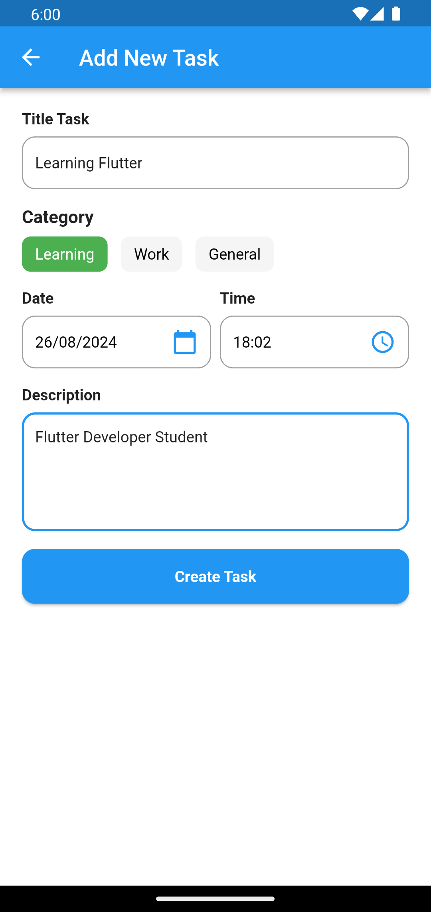
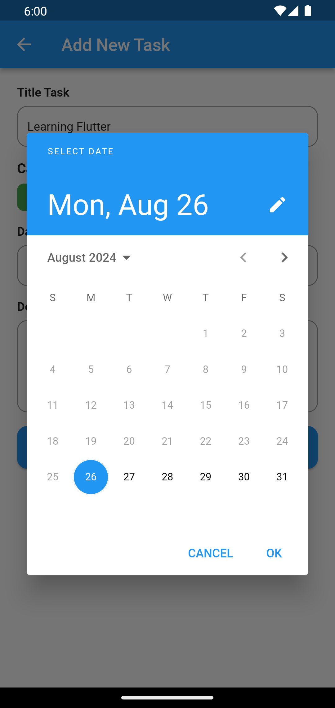
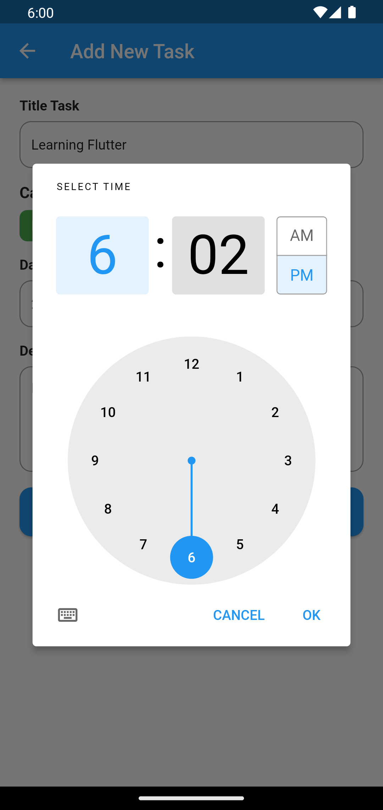
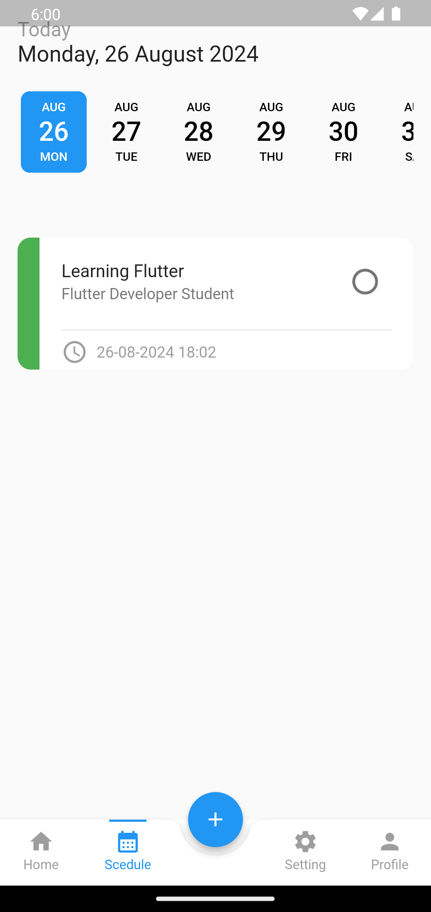

# Todo Reminder App

 |   |  | 

## :tada: Features App
- Clean Code with Clean Architecture BLOC
- Add Todo with Reminder Notification
- Update Todo
- Update Status Todo (Pending to Completed)
- Get Todo by Date
- Get Pending Todo
- Get Completed Todo
- Authentication Login Register Logout

## :hammer_and_wrench: Built With
- Bloc
- Get Tt
- Dartz
- Equtable
- Flutter Local Notification
- Cloud Firestore
- Firebase Auth
- Shared Preferences
- Date Picker Timeline

